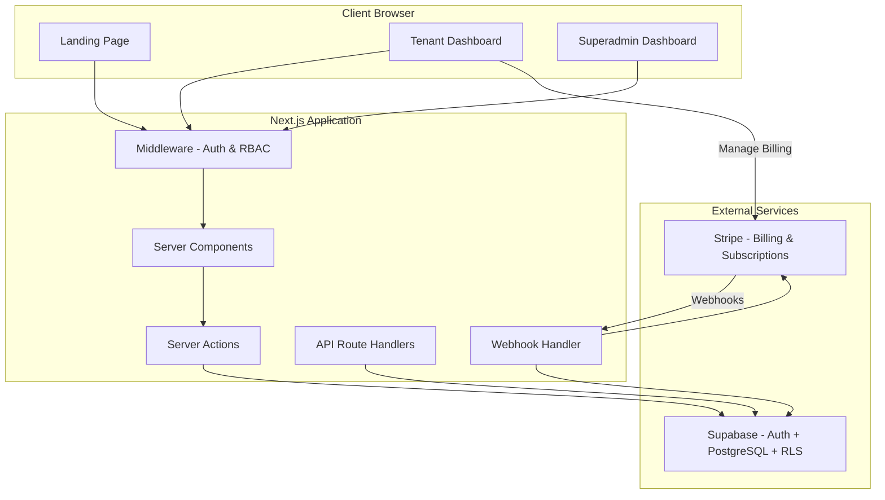
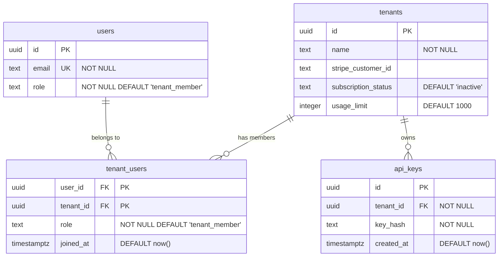
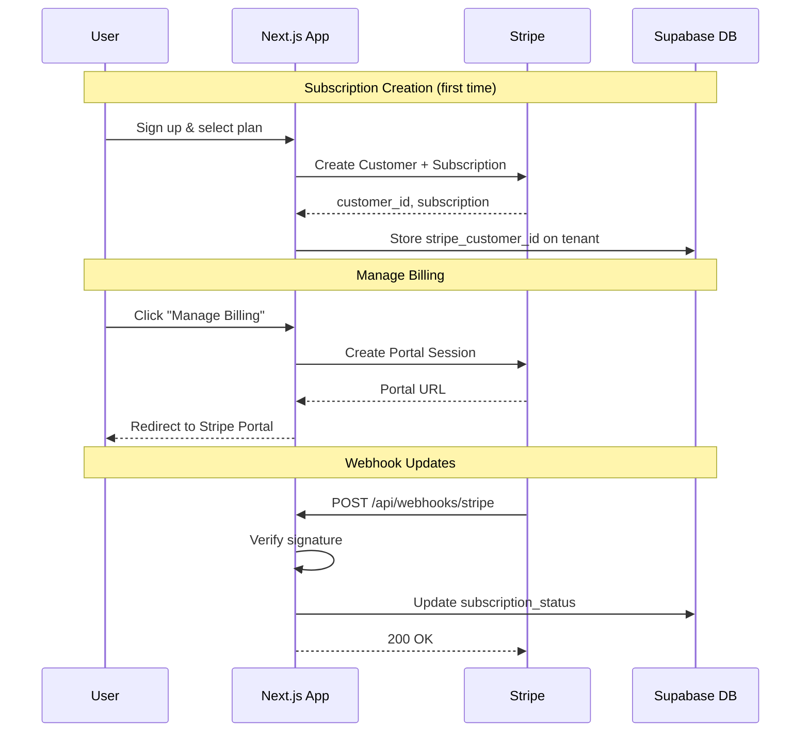

# Design Document: Morphis SaaS MVP

## Overview

Morphis is a full-stack B2B SaaS MVP built with Next.js 14+ (App Router), TypeScript, Supabase, and Stripe. The application serves three user segments through distinct interfaces:

1. **Public visitors** — Marketing landing page with product information and pricing
2. **Tenant users** — Protected dashboard for managing API keys, team, billing, and usage
3. **Superadmins** — Administrative dashboard for platform oversight

The architecture follows a server-first approach leveraging Next.js App Router's server components, server actions, and route handlers. Supabase provides the database (PostgreSQL), authentication, and row-level security. Stripe handles all billing operations through webhooks and the Customer Portal.

### Key Design Decisions

- **Server Components by default**: Minimize client-side JavaScript; use `"use client"` only for interactive components
- **Middleware-based auth**: Next.js middleware validates sessions and enforces RBAC before page rendering
- **Webhook-driven billing**: Stripe webhooks are the source of truth for subscription state — no polling
- **RLS as defense-in-depth**: Even if application logic has bugs, RLS prevents cross-tenant data access
- **Environment validation at startup**: Fail fast if configuration is incomplete

---

## Architecture

### High-Level System Diagram



### Request Flow

1. Browser requests a route
2. Next.js middleware intercepts, validates session via Supabase Auth
3. Middleware checks role against route requirements (`/admin` → superadmin, `/dashboard` → authenticated)
4. Server component renders with data fetched server-side using Supabase client
5. Client components handle interactivity (forms, modals, toasts)
6. Server actions execute mutations (create key, invite member, etc.)
7. Stripe webhooks arrive at `/api/webhooks/stripe` and update subscription state

### Directory Structure

```
morphis/
├── .env.example
├── next.config.ts
├── tailwind.config.ts
├── tsconfig.json
├── schema.sql
├── src/
│   ├── app/
│   │   ├── layout.tsx              # Root layout (font, theme, Toaster)
│   │   ├── page.tsx                # Home page
│   │   ├── who-we-are/page.tsx
│   │   ├── contact/page.tsx
│   │   ├── pricing/page.tsx
│   │   ├── auth/
│   │   │   ├── login/page.tsx
│   │   │   ├── register/page.tsx
│   │   │   ├── reset-password/page.tsx
│   │   │   └── callback/route.ts   # Supabase auth callback
│   │   ├── dashboard/
│   │   │   ├── layout.tsx          # Dashboard shell (sidebar + header)
│   │   │   ├── page.tsx            # Usage stats (default)
│   │   │   ├── api-keys/page.tsx
│   │   │   ├── team/page.tsx
│   │   │   └── billing/page.tsx
│   │   ├── admin/
│   │   │   ├── layout.tsx          # Admin shell
│   │   │   ├── page.tsx            # Tenants list + metrics
│   │   │   ├── users/page.tsx
│   │   │   └── support/page.tsx
│   │   └── api/
│   │       └── webhooks/
│   │           └── stripe/route.ts
│   ├── components/
│   │   ├── ui/                     # Shadcn UI components
│   │   ├── landing/                # Landing page components
│   │   ├── dashboard/              # Dashboard components
│   │   ├── admin/                  # Admin components
│   │   └── shared/                 # Navbar, Footer, Toast provider
│   ├── lib/
│   │   ├── supabase/
│   │   │   ├── client.ts           # Browser Supabase client
│   │   │   ├── server.ts           # Server Supabase client
│   │   │   └── admin.ts            # Service role client
│   │   ├── stripe/
│   │   │   ├── client.ts           # Stripe SDK instance
│   │   │   └── portal.ts           # Customer Portal session creation
│   │   ├── env.ts                  # Environment validation
│   │   └── utils.ts                # Shared utilities
│   ├── actions/
│   │   ├── auth.ts                 # Auth server actions
│   │   ├── api-keys.ts             # API key CRUD actions
│   │   ├── team.ts                 # Team management actions
│   │   ├── billing.ts              # Billing actions
│   │   ├── tenants.ts              # Tenant management (admin)
│   │   └── usage.ts                # Usage stats queries
│   ├── middleware.ts               # Auth + RBAC middleware
│   └── types/
│       ├── database.ts             # Database row types
│       └── index.ts                # Shared types
└── supabase/
    └── migrations/
        └── 001_initial_schema.sql
```

---

## Components and Interfaces

### Middleware (`src/middleware.ts`)

```typescript
interface MiddlewareConfig {
  publicRoutes: string[];        // Routes that don't require auth
  adminRoutes: string[];         // Routes requiring 'superadmin' role
  protectedRoutes: string[];     // Routes requiring any authenticated user
}
```

**Behavior:**
- Reads Supabase session from cookies
- For protected routes: redirects to `/auth/login` if no session
- For admin routes: redirects to `/dashboard` if role ≠ 'superadmin'
- Refreshes session token if close to expiry

### Supabase Clients

| Client | File | Key Used | Context |
|--------|------|----------|---------|
| Browser client | `lib/supabase/client.ts` | Anon key | Client components |
| Server client | `lib/supabase/server.ts` | Anon key + cookies | Server components, actions |
| Admin client | `lib/supabase/admin.ts` | Service role key | API routes (webhooks) |

### Server Actions Interface

```typescript
// actions/api-keys.ts
export async function generateApiKey(): Promise<{ key: string } | { error: string }>
export async function deleteApiKey(keyId: string): Promise<{ success: boolean } | { error: string }>
export async function listApiKeys(): Promise<{ keys: ApiKey[] } | { error: string }>

// actions/team.ts
export async function inviteTeamMember(email: string): Promise<{ success: boolean } | { error: string }>
export async function updateMemberRole(userId: string, role: Role): Promise<{ success: boolean } | { error: string }>
export async function removeMember(userId: string): Promise<{ success: boolean } | { error: string }>
export async function listTeamMembers(): Promise<{ members: TeamMember[] } | { error: string }>

// actions/billing.ts
export async function createPortalSession(): Promise<{ url: string } | { error: string }>

// actions/usage.ts
export async function getUsageStats(): Promise<{ stats: UsageStats } | { error: string }>

// actions/tenants.ts (admin)
export async function listTenants(page: number): Promise<{ tenants: Tenant[]; total: number } | { error: string }>
export async function updateTenantUsageLimit(tenantId: string, limit: number): Promise<{ success: boolean } | { error: string }>
```

### Webhook Handler Interface

```typescript
// app/api/webhooks/stripe/route.ts
export async function POST(request: Request): Promise<Response>
// Verifies signature, processes events:
// - customer.subscription.updated → update subscription_status
// - customer.subscription.deleted → set status to 'canceled'
// Returns 200 on success, 400 on signature failure
```

### Component Hierarchy

#### Landing Page

```
RootLayout
├── Navbar (shared, links: Home, Who We Are, Contact, Pricing, Login)
├── [Page Content]
│   ├── HomePage
│   │   ├── HeroSection (value proposition, CTA)
│   │   ├── FeaturesSection
│   │   └── CTASection
│   ├── WhoWeArePage
│   │   └── TeamSection
│   ├── ContactPage
│   │   └── ContactForm
│   └── PricingPage
│       ├── PricingCard (per tier)
│       └── FeatureComparisonTable
└── Footer (shared)
```

#### Tenant Dashboard

```
DashboardLayout
├── Sidebar
│   ├── TenantName
│   ├── NavLink (Usage Stats) [active indicator]
│   ├── NavLink (API Keys)
│   ├── NavLink (Team)
│   ├── NavLink (Billing)
│   └── LogoutButton
├── Header
│   ├── MobileMenuToggle (< 768px)
│   ├── PageTitle
│   └── UserEmail
└── MainContent
    ├── UsageStatsPage
    │   ├── StatCard (Total API Calls)
    │   ├── StatCard (Current Period Calls)
    │   ├── StatCard (Remaining Quota)
    │   └── LoadingSpinner / ErrorRetry
    ├── ApiKeysPage
    │   ├── GenerateKeyButton (disabled at limit)
    │   ├── NewKeyDisplay (temporary, dismissible)
    │   ├── ApiKeyList
    │   │   └── ApiKeyRow (masked value, date, copy/delete buttons)
    │   └── DeleteConfirmDialog
    ├── TeamPage
    │   ├── InviteForm (email input + submit)
    │   ├── TeamMemberList
    │   │   └── MemberRow (email, role, joined, role-change/remove)
    │   └── RemoveConfirmDialog
    └── BillingPage
        ├── CurrentPlanCard (status, plan name)
        └── ManageBillingButton → Stripe Portal
```

#### Superadmin Dashboard

```
AdminLayout
├── AdminSidebar
│   ├── NavLink (Tenants)
│   ├── NavLink (Users)
│   └── NavLink (Support)
├── AdminHeader
│   └── AdminBadge
└── AdminContent
    ├── TenantsPage
    │   ├── MetricsBar (active subs count, MRR)
    │   ├── TenantTable (paginated, 50/page)
    │   │   └── TenantRow (name, status, stripe_id, usage_limit edit)
    │   └── Pagination
    ├── UsersPage
    │   ├── UserTable (paginated, 50/page)
    │   │   └── UserRow (email, role, tenant)
    │   └── Pagination
    └── SupportPage
        ├── TicketList (subject, tenant, date, status)
        └── StatusUpdateDropdown
```

### Environment Validation (`src/lib/env.ts`)

```typescript
interface EnvConfig {
  NEXT_PUBLIC_SUPABASE_URL: string;
  NEXT_PUBLIC_SUPABASE_ANON_KEY: string;
  SUPABASE_SERVICE_ROLE_KEY: string;
  STRIPE_SECRET_KEY: string;
  STRIPE_WEBHOOK_SECRET: string;
  NEXT_PUBLIC_STRIPE_PUBLISHABLE_KEY: string;
}

export function validateEnv(): EnvConfig
// Throws with specific missing variable name if validation fails
// Treats empty strings as missing
```

---

## Data Models

### Database Schema



### Row Level Security Policies

| Table | Policy Name | Operation | Rule |
|-------|-------------|-----------|------|
| tenants | tenant_member_access | SELECT, UPDATE | `tenant_id IN (SELECT tenant_id FROM tenant_users WHERE user_id = auth.uid())` |
| tenant_users | own_tenant_access | ALL | `tenant_id IN (SELECT tenant_id FROM tenant_users WHERE user_id = auth.uid())` |
| api_keys | tenant_key_access | SELECT, INSERT, DELETE | `tenant_id IN (SELECT tenant_id FROM tenant_users WHERE user_id = auth.uid())` |
| ALL tables | superadmin_full_access | SELECT | `EXISTS (SELECT 1 FROM users WHERE id = auth.uid() AND role = 'superadmin')` |

### TypeScript Types

```typescript
// types/database.ts
export type Role = 'superadmin' | 'tenant_owner' | 'tenant_member';
export type SubscriptionStatus = 'active' | 'past_due' | 'trialing' | 'unpaid' | 'canceled' | 'inactive';
export type TicketStatus = 'open' | 'in_progress' | 'closed';

export interface User {
  id: string;
  email: string;
  role: Role;
}

export interface Tenant {
  id: string;
  name: string;
  stripe_customer_id: string | null;
  subscription_status: SubscriptionStatus;
  usage_limit: number;
}

export interface TenantUser {
  user_id: string;
  tenant_id: string;
  role: 'tenant_owner' | 'tenant_member';
  joined_at: string;
}

export interface ApiKey {
  id: string;
  tenant_id: string;
  key_hash: string;
  created_at: string;
}

export interface UsageStats {
  totalCalls: number;
  currentPeriodCalls: number;
  remainingQuota: number;
}

export interface TeamMember {
  user_id: string;
  email: string;
  role: 'tenant_owner' | 'tenant_member';
  joined_at: string;
}
```

### Stripe Integration Data Flow



---
